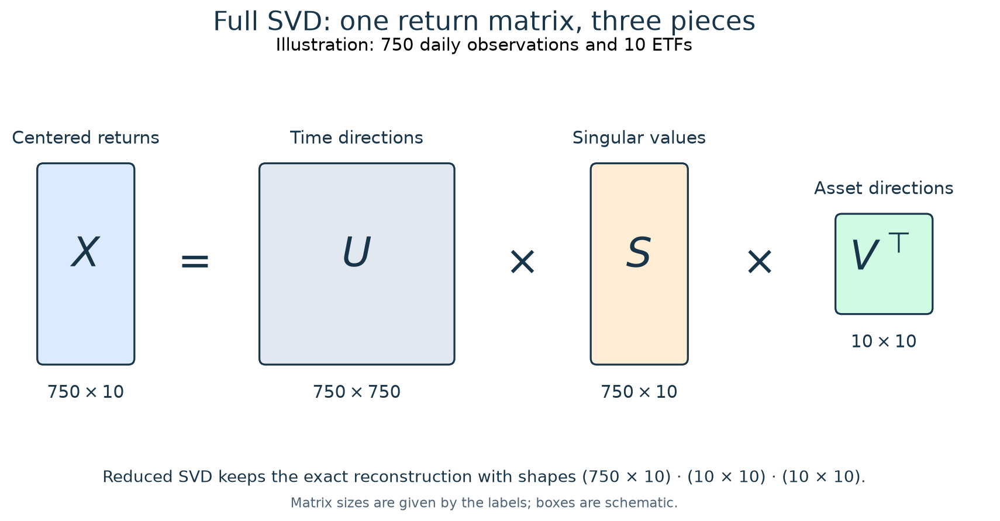
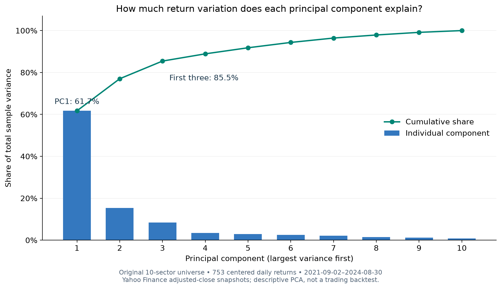
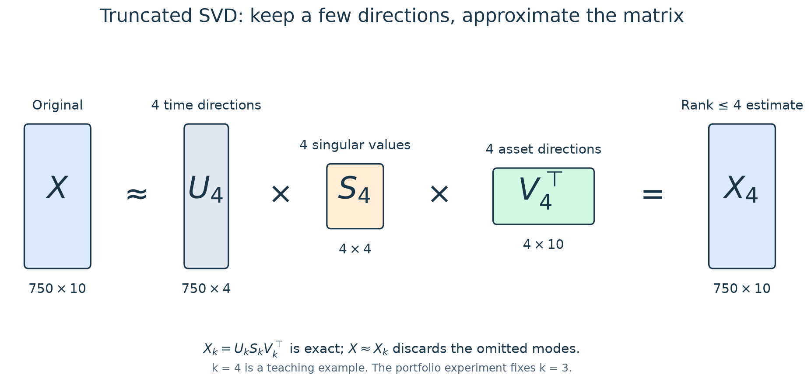

# SVD and PCA for Systematic Investing

**From matrix decomposition to portfolio risk—with reproducible ETF experiments.**

A portfolio can hold many ETFs and still depend on only a few common sources of risk.
Technology, industrials, and consumer stocks often move together; several bond funds may
respond to the same change in interest rates. Counting tickers tells us little about the
number of independent bets we are making.

Singular value decomposition (SVD) and principal component analysis (PCA) help us examine
that shared structure. This project explains the mathematics, shows how to turn it into a
portfolio risk model, and tests whether that model improves an actual allocation rule.

It accompanies [my original blog post](https://quhiquhihi.github.io/posts/SVD_and_Portfolio/)
and the expanded [article draft](docs/blog_draft.md). Start here for the concepts and a runnable
entry point; use the notebooks for the complete empirical analysis.

## 1. Start with a matrix of returns

Let $R$ contain $T$ daily observations of $N$ assets. Rows are dates; columns are ETFs.
For PCA, subtract each asset's sample mean to obtain the centered matrix $X$:

$$
X_{t,i}=R_{t,i}-\bar R_i.
$$

In a trading system, these means—and every other fitted quantity—must be estimated from
information available at the decision date.

## 2. What SVD tells us

SVD factorizes the matrix as

$$
X=USV^\top.
$$



*The dimensions are illustrative: 750 observations and ten ETFs. The current sector backtest
uses eleven ETFs; the historical teaching example below retains the original ten.*

| Piece | Interpretation for a time-by-asset return matrix |
|---|---|
| $V$ | Asset-space directions, or loading vectors: which assets participate in each mode |
| $S$ | Nonnegative singular values: the magnitude of each mode |
| $U$ | Normalized patterns through time |
| $US=XV$ | Component scores: those patterns with their actual scale restored |

The relation $Xv_i=s_i u_i$ connects the pieces. An asset-space direction $v_i$ maps to a
time pattern $u_i$, scaled by $s_i$. The directions are orthogonal, but this does not make
the underlying economic drivers independent.

The picture shows **full SVD**. With more observations than assets, the reduced form used
in NumPy has shapes $(T\times N)(N\times N)(N\times N)$. It reconstructs the same matrix
without constructing a large $T\times T$ array. See the
[NumPy SVD documentation](https://numpy.org/doc/stable/reference/generated/numpy.linalg.svd.html).

## 3. How SVD becomes PCA

PCA identifies directions with the largest sample variance. For centered returns,

$$
\widehat\Sigma=\frac{X^\top X}{T-1}
=V\operatorname{diag}\!\left(\frac{s_i^2}{T-1}\right)V^\top.
$$

So the right singular vectors are the principal directions, and the covariance eigenvalues
are $\lambda_i=s_i^2/(T-1)$. SVD is the matrix factorization; PCA is the statistical use of
that factorization on centered data. The explained-variance share is

$$
\mathrm{EVR}_i=\frac{s_i^2}{\sum_j s_j^2}.
$$



*Recomputed from 753 centered daily returns, September 2, 2021–August 30, 2024, using cached
Yahoo Finance adjusted closes. PC1 explains 61.7%; the first three explain 85.5%. This is a
descriptive illustration, separate from the rolling backtest. The original uncentered chart
is preserved with the [original images](docs/assets/svd/originals/).*

The percentage describes total sample variance across the assets. It is not a percentage of
future returns, a measure of expected profit, or necessarily the variance share of a particular
portfolio. For a chosen portfolio, its exposures to the principal directions also matter.

## 4. Keep fewer components

Keeping the largest $k$ singular values gives a low-rank approximation:

$$
X_k=U_kS_kV_k^\top\approx X.
$$



*Four components illustrate the matrix dimensions; the research specification fixes three.*

This retains the strongest common patterns while discarding the remaining modes. It also
introduces a modeling choice: a small component can contain a useful hedge, so retaining a
large share of historical variance does not establish that the approximation will invest well.

## 5. Turn a decomposition into an investment rule

SVD/PCA can help with risk diagnostics, factor exposure measurement, hedging, and feature
compression. This repository implements one specific application: **covariance estimation
for constrained minimum-variance portfolios**.

A pure rank-$k$ covariance model gives zero risk to omitted directions. We retain residual
asset variances instead:

$$
\widehat\Sigma_k=V_k\Lambda_kV_k^\top+
\operatorname{diag}\!\left(\operatorname{diag}
\left(\widehat\Sigma-V_k\Lambda_kV_k^\top\right)\right).
$$

The model preserves each asset's sample variance and assumes the remaining cross-asset
covariances are zero. We then minimize $w^\top\widehat\Sigma_k w$ subject to full investment,
long-only positions, and a maximum target weight per ETF.

The leading principal component maximizes variance under a unit-length constraint. It is not
an allocation objective. Taking absolute loadings or dividing returns by a singular value
changes the strategy without supplying a clear economic rationale. The article explains how
factor directions, portfolio weights, and risk contributions differ.

## The research question

**Does a PCA factor covariance model improve subsequent portfolio risk and risk forecasts
relative to sample covariance and Ledoit–Wolf shrinkage, after trading costs?**

The two experiments use eleven US sector ETFs and twelve multi-asset ETFs. Each uses 504 past
sessions, three factors, monthly rebalancing, a 30% target-position cap, and 5 bps per dollar
bought or sold. Decisions use the previous session's information, execute at the next close,
and earn new-position returns afterward. Holdings drift between trades.

Equal weight and capped inverse volatility provide simpler controls. SPY and AOM provide
market context, with different exposures. The January 2025–August 2026 test is retrospective;
it is not a genuinely untouched holdout.

The [executed results](docs/results_summary.md) show a small, uncertain sector advantage over
shrinkage and a small multi-asset effect in portfolios dominated by bonds. Sector rankings change
under several reasonable settings, and neither universe establishes better risk forecasting.
Understanding these limits is part of understanding the method.

## Explore the implementation

- [US sector notebook](SVD-US_Equity.ipynb) and [multi-asset notebook](SVD-Multi_Asset.ipynb):
  complete methods, executed tables, figures, uncertainty, and sensitivity checks.
- [Article draft](docs/blog_draft.md): a longer explanation from SVD intuition to systematic investing.
- [Research protocol](docs/research_protocol.md): timing, accounting, estimators, and metric definitions.
- [Original-project review](docs/research_review.md): methodological corrections and their motivation.
- [Figure provenance](docs/assets/svd/README.md): originals, corrected diagrams, and chart inputs.
- [Publishing guide](docs/PUBLISHING.md): GitHub assets and a prepared Jekyll post bundle.

Core code lives in `src/svd_portfolio/`: `models.py` estimates covariance and optimizes weights;
`backtest.py` handles timing, drift, and costs; `metrics.py` supplies evaluation and uncertainty.
The original notebooks remain unchanged in `archive/`.

## Reproduce the project

Use Linux Python and `uv` from the project root. Python 3.12 is selected by `.python-version`;
`pyproject.toml` and `uv.lock` specify the environment.

```bash
uv sync --locked
uv run python scripts/run_research.py --download --sensitivity
uv run python scripts/execute_notebooks.py
uv run python scripts/write_results.py
uv run python scripts/build_article_assets.py
uv run pytest -q
uv run ruff check src scripts tests
```

Downloads checkpoint each ticker in `data/raw/`. Subsequent runs use those snapshots, so the
notebooks can execute offline. An interrupted download resumes with the same command.
`--refresh --download` explicitly requests a new vendor vintage, which may revise past results.

Each snapshot has source metadata and a SHA-256 hash. `outputs/<universe>/` contains trades,
daily holdings, forecasts, metrics, and a manifest linking the result files to the data and code.
A notebook is replaced only after successful execution. `scripts/build_notebooks.py` rebuilds
the notebook text and clears its outputs; use it only when changing that shared template.

Raw data, environments, caches, and `outputs/` are excluded from version control.
**Publication figures are included under `docs/assets/svd/`**, so the README and article remain
readable on GitHub without executing anything. PNGs support straightforward Markdown rendering;
SVGs are available for high-resolution use.

In restricted environments, set `UV_CACHE_DIR=/tmp/svd-uv-cache` when invoking `uv`. Once the
environment and data are available, `uv run --offline ...` avoids dependency-network requests.
See the [validation record](docs/validation.md) for the research checks and their scope.
